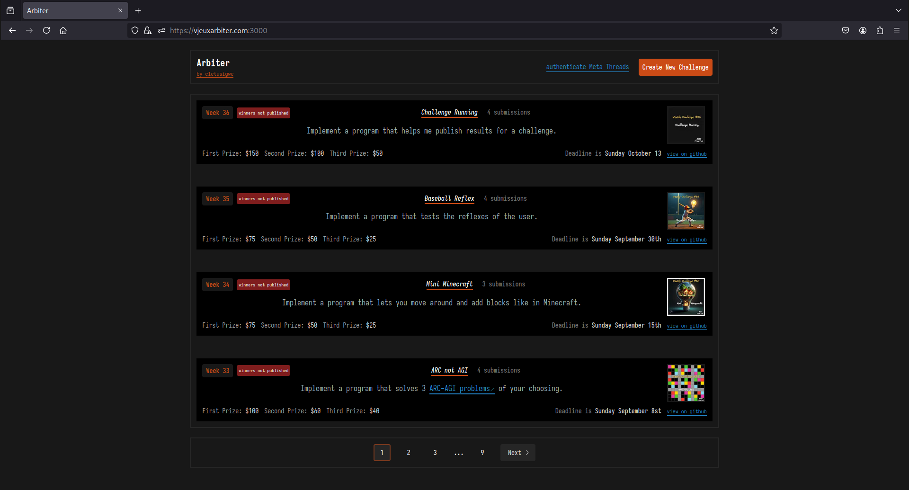
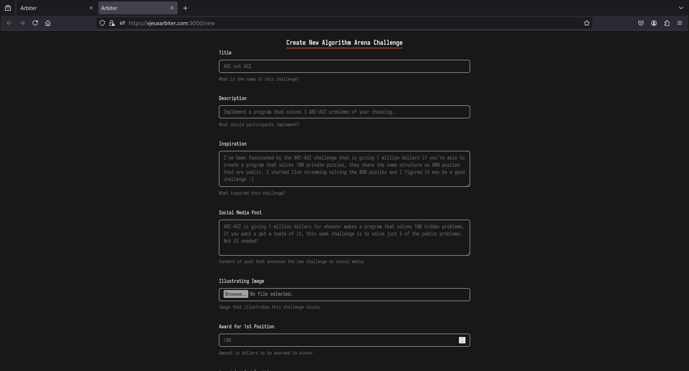
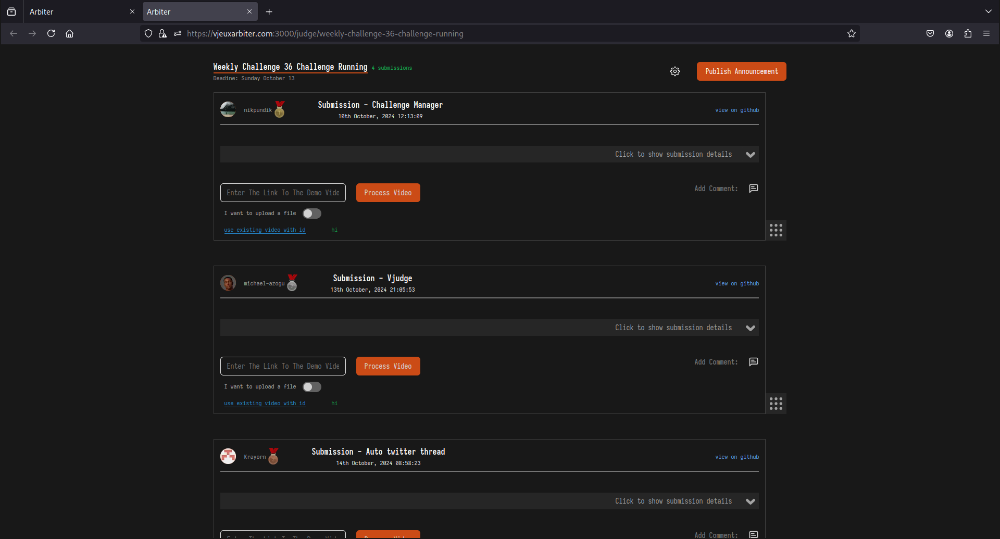
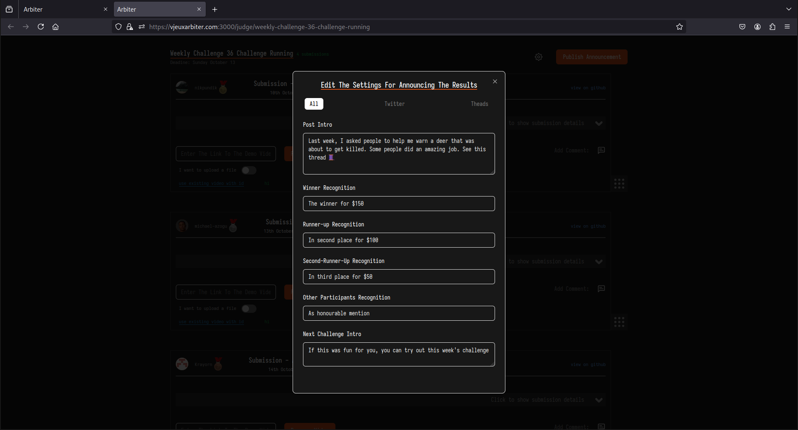
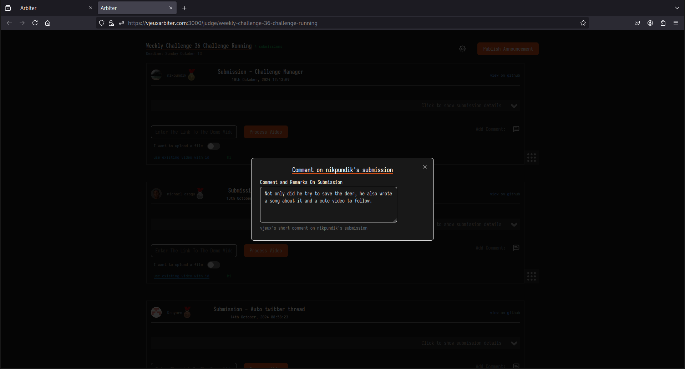

<p align="center">

</p>

---

Last week (today is 23-10-2024), @vjeux posted a [new challenge](https://github.com/Algorithm-Arena/weekly-challenge-36-challenge-running) for his weekly algorithm arena. It was an unusual challenge, requiring a somewhat high bar for a correct solution. I took his wishes to be my commands and spent the last 5 days building the best implementation of an automated algorithm arena environment.

While building this I gave myself the following constraints:

| Constraint                                                        | What it means                                                                                     | Consequences                                                                                                                                                                                                                                                                                                                                                                                                                                                                                                                                                                                                                                                                                                                                                                                                                  |
| ----------------------------------------------------------------- | ------------------------------------------------------------------------------------------------- | ----------------------------------------------------------------------------------------------------------------------------------------------------------------------------------------------------------------------------------------------------------------------------------------------------------------------------------------------------------------------------------------------------------------------------------------------------------------------------------------------------------------------------------------------------------------------------------------------------------------------------------------------------------------------------------------------------------------------------------------------------------------------------------------------------------------------------- |
| Zero maintenance cost and runs entirely on the user local machine | The program must cost vjeux nothing to run. It must only utilise free apis and hosting solutions. | <ol><br><li>I used self-signed ssl certificates and nginx as a proxy to fake https, because meta's threads api requires all callback(for authenticating accounts) urls to be https.</li><br><li>My program will download, rencode and store all submission videos in a seperate github repository so that every video can have a public shareable url. Github provides a file service like this in the browser interface but doesnt support it in the api. This decision was also taken to circumvent meta thread's api requirement that all media must be hosted on a public CURLable url.</li><br></ol><br>                                                                                                                                                                                                           |
| Intuitive to use                                                  | The program must feel comfortable to use and easy to debug.                                       | <ol><li>Ranking submissions is done by dragging submission items in a drag and reorder interface</li><li>User has the choice of either uploading a video file to include in the announcement of challenge result or pasting a link to the video itself to be downloaded with yt-dlp</li><li>User can see real-time logs from the browser during the video processing step which involves downloading submission videos with `ytdlp` and reencoding into a format suitable for both twitter and threads using `ffmpeg`</li><li>I put a lot of effort into making sure that the browser interface looks visually appealing while staying functional.</li><li>The database for storing auth secrets, timestamps and other variable program information is a simple `db.json` file with the schema located at `db_schema.ts`</ol> |

Unfortunately, some of these contraints lead me into very deep rabbit holes where I emerged with unnecessarily complicated code. One example is that although I believe I had a correct implementation for signing twitter oauth1.0-a requests (located in `src/lib/upload_video.ts`), I could not get it to work for uploading videos to twitter. I ported the same code to python with help from [here](https://github.com/xdevplatform/large-video-upload-python) and it worked. So I restructured the python code as a command line script and then used it for uploading files by spawning a new shell via `child_process.exec`. This means that the user needs to setup a python environment, `pip install oauthlib requests requests-oauthlib` and provide the `.env` file with a `PYTHON_PATH`

Running this webapp requires your `.env` file to look something like this:

#### .env.example

```env
NEXT_PUBLIC_BASE_URL=https://vjeuxarbiter.com #url for accessing the website on https

GITHUB_USERNAME= #github username of user with the github auth tokens, useful because it saves me some github api requests to obtain user id.

GITHUB_DEMO_VIDEOS_REPO= #a public github repository owned by $GITHUB_USERNAME where submission videos and their thumbnails will be saved.

GITHUB_PERSONAL_ACCESS_TOKEN= #github user personal access token. generate yours here: https://github.com/settings/tokens


TWITTER_USERNAME= #twitter username of the user who intends to use this program, putting it here felt convenient. I plan to later get it during user auth flow and storing in db.json

TWITTER_OAUTH2_CLIENT_ID= #twitter oauthv2 client id which can be generated under the 'Keys and Tokens' section of the developer.x.com portal

TWITTER_OAUTH2_CLIENT_SECRET= #twitter oauthv2 client secret which can be generated under the 'Keys and Tokens' section of the developer.x.com portal

TWITTER_ACCESS_TOKEN=  #twitter user-specific credentials used to authenticate OAuth 1.0a API requests. It can be generated under the 'Keys and Tokens' section of the developer.x.com portal

TWITTER_ACCESS_TOKEN_SECRET=  #twitter user-specific credentials used to authenticate OAuth 1.0a API requests. It can be generated under the 'Keys and Tokens' section of the developer.x.com portal

TWITTER_CONSUMER_KEY= #twitter key that uniquely identifies the app. It can be generated under the 'Keys and Tokens' section of the developer.x.com portal

TWITTER_CONSUMER_SECRET= #twitter secret key that uniquely identifies the app. It can be generated under the 'Keys and Tokens' section of the developer.x.com portal


META_APP_ID= #meta/facebook unique key that uniquely identifies the app to Meta. It can be generated under the 'App settings > Basic' section of the developers.facebook.com portal

META_APP_SECRET= #meta/facebook secret key that uniquely identifies the app to Meta. It can be generated under the 'App settings > Basic' section of the developers.facebook.com portal

THREADS_APP_ID= #meta/facebook unique key that uniquely identifies the app to Meta's Threads app. It can be generated under the 'App settings > Basic' section of the developers.facebook.com portal

THREADS_APP_SECRET= #meta/facebook unique secret that uniquely identifies the app to Meta's Threads app. It can be generated under the 'App settings > Basic' section of the developers.facebook.com portal

PYTHON_PATH= #path to a python binary located in an environment where the python OAuth1 package is installed.
```

The following permissions are needed on each platform token:

| Platform/token | Permission scopes on token | Reason |
| ---- | ---- | ---- |
| github/personal_access_token | repo.public_repo | App needs this permission to be able to read and commit to user 's public repositories |
| twitter/oauth-1.0a_token_and secret | Read and Write | The Write permission allows us to upload media on behalf of the user. The Read permission is the default constant permission. |
| twitter/access_token | tweet.read | Read authenticated twitter user's tweets and obtain tweet ids |
| twitter/access_token | tweet.write | Post Single Tweets and make Tweet Threads on behalf of the user |
| twitter/access_token | users.read | Allows the authenticated user to reply another tweet which is a requirement for making twitter threads. |
| twitter/access_token | offline.access | Allows twitter_access_token to be valid until user revokes access instead of only lasting for 2 hours |
| threads/access_token | threads_basic | Default constant permission |
| threads/access_token | threads_content_publish | Allows to post on behalf of user |
| threads/access_token | manage_replies | Allows to reply on behalf of authenticated user which is needed to make a thread of posts and quote posts. |


### Screenshots












### How To Setup

#### 1. Install [FFMPEG](https://github.com/FFmpeg/FFmpeg), [Nginx](https://nginx.org/en/) and [yt-dlp](https://github.com/yt-dlp/yt-dlp)

##### 2. Setup SSL Root Certificates in ./certificates

```sh
mkdir certificates/
cd certificates/

#set Common Name to vjeuxarbiter.com or your preferred domain
openssl req -x509 -nodes -days 365 -newkey rsa:2048 -keyout vjeuxarbiter.key -out vjeuxarbiter.crt
```

##### 3. Edit  the /etc/nginx/nginx.conf file to make sure it searches for sites under /etc/nginx/sites-enabled/

```
# Add this under the http block of the config 

include /etc/nginx/sites-enabled/*;
```

##### 4. Map the domain name you chose to localhost in your /etc/hosts file

Add this to end of file at /etc/hosts

```config
127.0.0.1 vjeuxarbiter.com #replace vjeuxarbiter.com with the domain you chose
```

##### 5. Edit /etc/nginx/sites-available/vjeuxarbiter to setup the proxy server

Your `/etc/nginx/sites-available/vjeuxarbiter` will look like this

```sh
server{
	listen 443 ssl;
	listen [::]:443 ssl;
	server_name vjeuxarbiter.com;
	
	ssl_certificate  <PROJECT_ROOT_DIR>/certificates/vjeuxarbiter.crt;
	ssl_certificate_key <PROJECT_ROOT_DIR>/certificates/vjeuxarbiter.key;

	location / {
		proxy_pass http://localhost:2005;
		proxy_set_header Host $host;
		proxy_set_header X-Real-IP $remote_addr;
		proxy_set_header X-Forwarded-For $proxy_add_x_forwarded_for;
		proxy_set_header X-Forwarded-Proto $scheme;
	}
}


server{
	listen 80;
	server_name vjeuxarbiter.com;
	return 301 https://$host$request_uri;
}

```

then publish the site by creating a symlink in the `/etc/nginx/sites-enabled` dir by running:

```sh
sudo ln -s /etc/nginx/sites-available/vjeuxarbiter /etc/nginx/sites-enabled
```


##### 6. Setup a python environment

```sh
pip -m venv path_to_venv
source path_to_venv/bin/activate
pip install oauthlib requests requests-oauthlib
```

EDIT `.env` by setting `PYTHON_PATH=path_to_venv/bin/python`

##### 7. Create Necessary files and directories

```sh
touch db.json
mkdir downloaded_videos processed_videos challenge_images logs
```

##### 8. Remember to set auth callback url in your Twitter/Thread Developer portal

1. For twitter, auth callback is `/api/twitter/callback`
2. For threads, auth callback is `/api/threads/callback`

> remember that your signed certificates and `/etc/hosts` modification means that  the full url is something like `https://vjeuxarbiter.com/api/threads/callback`

### Running the server

###### Install dependencies

```sh
npm install
```

###### Run your dev server

```sh
npm run dev
```

**Make sure nginx is running as a service and then visit https://vjeuxarbiter.com on your browser**


\*\*\* am thinking that it would be more organised to store submission videos for each challenge in the challenge's repo instead of in a different seperate repo.

